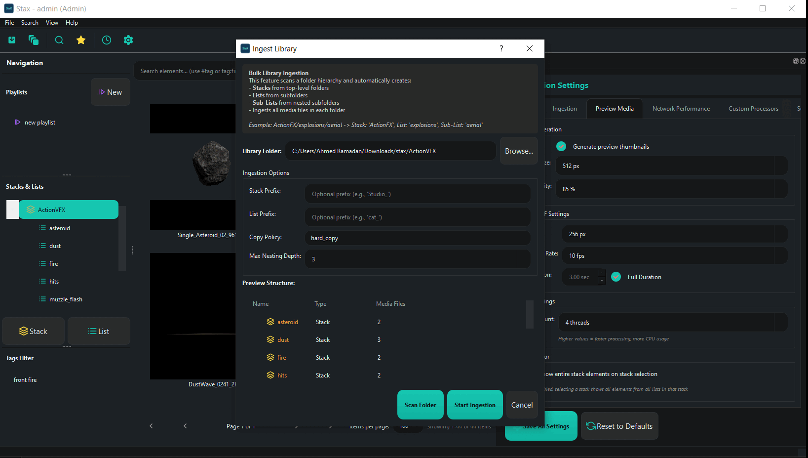
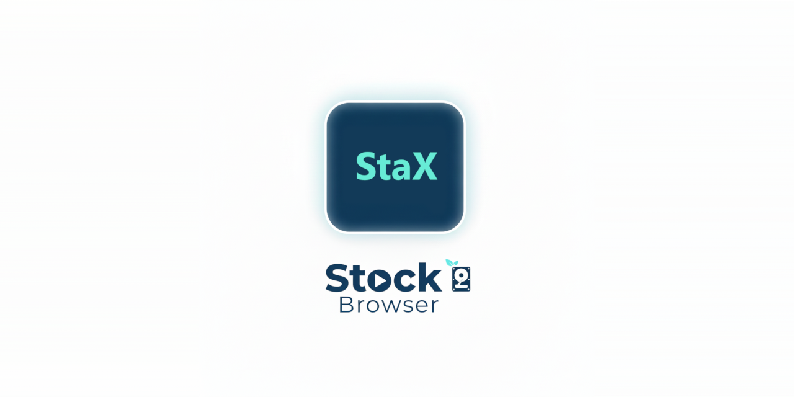

<p align="center">
  <a href="https://github.com/aramadan0096/Stax"></a>
</p>
<p align="center">
    <em>Professional stock footage and asset management system for VFX pipelines</em>
</p>


StaX is an advanced media browser and asset management tool designed specifically for integration with Foundry Nuke. It provides powerful features for organizing, searching, and deploying visual effects assets with intelligent sequence detection, automated preview generation, and extensible pipeline hooks.




</details>
---

## What is StaX?

StaX helps VFX artists and studios manage large collections of stock footage, 3D assets, and Nuke toolsets through:

- **Hierarchical Organization**: Organize assets into Stacks → Lists → Elements with support for nested sub-lists
- **Smart Ingestion**: Automatic image sequence detection, frame range discovery, and metadata extraction
- **Ingestion Automation**: Durable job queue with retry, polling watch-folders, ingest recipes, and duplicate-policy resolution
- **Dual-Path Storage**: Choose between hard copies (physical repository) or soft copies (reference links)
- **Rich Previews**: Automatic thumbnail, GIF, and video preview generation for quick asset review
 - **Interactive 3D Preview**: Inspect geometry assets directly inside StaX with the built-in Scene Viewer. The viewer embeds a lightweight WebGL frontend (the bundled `js-3d-model-viewer`) to render `glb`/`gltf` payloads inside the preview pane. For non-GLB geometry sources StaX can convert assets to GLB using Blender (via the tracked `src/convert_to_glb.py` script) or attempt Python-library fallbacks so they can be inspected in the viewer.
- **Curation**: Star ratings, color labels, favorites, playlists, and multi-select bulk actions
- **Search & Discovery**: Faceted filtering, saved searches, shared smart collections, synonyms, and "did-you-mean" suggestions
- **Local AI Discovery**: Text (semantic), image (visual), and "find similar" search plus auto-tag suggestions — all offline via a local CLIP model. Color-palette search works with no model. See the [User Guide](docs/USER_GUIDE.md#6-ai-discovery)
- **Custom Metadata**: Per-stack typed custom fields with inheritance, metadata templates, and auto-tagging at ingest
- **Team Collaboration**: Granular role/permission matrix, activity feed, and `.staxbundle` metadata/preview export–import (newest-wins)
- **Analytics**: Search-quality, storage-hygiene, and top-used-asset dashboards with CSV export
- **Nuke Integration**: Drag and drop assets directly into Nuke's Node Graph with automatic Read/ReadGeo node creation
- **Network-Ready**: SQLite database with file locking for multi-user workstation access
- **Extensible**: Custom Python processors for pre-ingest validation, post-ingest hooks, and post-import node configuration

<!--  -->

---
**Quick Setup:**

```bash
# Clone repository
git clone --recurse-submodules https://github.com/aramadan0096/Stax.git
cd Stax
# Install libraries
.\tools\install_libs_requirements_uv.ps1
# Download dependencies and run
.\tools\run_standalone.ps1
```
---
## Documentation

- **[User Guide](docs/USER_GUIDE.md)**: Quick-start walkthrough of everyday workflows, including the new local AI discovery features.
- **[documentation](https://aramadan0096.github.io/stax-docs/)**: An internal reference describing StaX features, installation, and usage.
<!-- - **[instructions.md](instructions.md)**: Complete technical specification and architecture
- **[Roadmap.md](Roadmap.md)**: Development phases, milestones, and feature roadmap
- **[changelog.md](changelog.md)**: Version history and release notes -->

---

## Project Status

**Current Phase:** Beta  
**Python Version:** 3.9+ (Windows & Linux)  
**GUI Framework:** PySide2 (Qt5)

**Completed Features:**
- ✅ Database layer with network-aware file locking and versioned migrations
- ✅ Ingestion engine with sequence detection
- ✅ Ingestion automation: job queue, retry, watch-folders, recipes, duplicate policies
- ✅ Async preview pipeline (off the GUI thread)
- ✅ Nuke integration (standalone and plugin modes)
- ✅ Extensibility hooks (custom processors)
- ✅ Complete GUI with gallery/list views + interactive 3D preview
- ✅ Preview generation (thumbnails, GIFs, videos)
- ✅ Curation: ratings, color labels, favorites, playlists, bulk actions
- ✅ Search & discovery: facets, saved searches, smart collections, synonyms
- ✅ **Local AI discovery: semantic / visual / similar search + auto-tags (offline CLIP); color-palette search**
- ✅ Custom metadata fields, templates, and auto-tagging
- ✅ Team collaboration: granular roles/permissions, activity feed, `.staxbundle` export–import
- ✅ Analytics dashboards (search, storage, top-used) with CSV export
- ✅ Drag & drop to Nuke DAG + toolset registration

See the **[User Guide](docs/USER_GUIDE.md)** for how to use these features.

---

## Contributing

StaX is under active development. Contributions, bug reports, and feature requests are welcome through GitHub Issues and Pull Requests.

## License

Copyright (c) 2025 Ahmed Ramadan

This project is provided for non-commercial use under the following terms:

- You are free to use, modify, and distribute the software for personal, educational, or non-commercial research and development purposes.
- Commercial use (including distribution, sale, or incorporation into a commercial product or service) is NOT permitted without prior written permission from the copyright holder. To request permission, please send an email to <a href="mailto:ahmedramadan347@gmail.com">ahmedramadan347@gmail.com</a>.

To request commercial licensing or permission, contact the author at the address listed in the project metadata or open an issue on the repository describing your intended commercial use.

If you require a standard open-source license instead (MIT, Apache, GPL, etc.), please contact the maintainer to discuss relicensing options.
